# Game Design Document

This is a placeholder for the GDD. Your team should replace the content of this
file with your own GDD from project 1, and continue to maintain it as discussed
in the project specification. 

Please **do not** update the repository from project 1, all updates to the GDD
going forward should be made to this file. **Make sure that you keep this file
named `GDD.md` and don't move it from the root directory of the repository.**

# Space Nomads

## Table of contents
* [Game Overview](#Game-Overview)
    * [Core Concept](#Core-Concept)
    * [Target Audience](#Target-Audience)
    * [Unique Selling Points (USPs)](#Unique-Selling-Points-(USPs))
* [Story and Narrative](#Story-and-Narrative)
    * [Backstory](#Backstory)
    * [Characters](#Characters)
* [Gameplay and Mechanics](#Gameplay-and-Mechanics)
    * [Gameplay](#Gameplay)
    * [Controls](#Controls)
    * [Weapons](#Weapons)
    * [Ship Stations and Buildings](#Ship-Stations-and-Buildings)
    * [Player Perspective](#Player-Perspective)
    * [Progression](#Progression)
* [Levels and World Design](#Levels-and-World-Design)
    * [Level and Game World](#Level-and-Game-World)
    * [Objects](#Objects)
    * [Buildings](#Buildings)
    * [Ship Stations](#Ship-Stations)
    * [Physics](#Physics)
* [Art and Audio](#Art-and-Audio)
    * [Art Style](#Art-Style)
    * [Sound Design](#Sound-Design)
    * [Music](#Music)
    * [Assets](#Assets)
* [User Interface (UI)](#User-Interface-(UI))
    * [UI Layout](#UI-Layout)
    * [UI Theme](#UI-Theme)
    * [Menu Screen](#Menu-Screen)
* [Technology and Tools](#Technology-and-Tools)
* [Possible Challenges](#Possible-Challenges)

---

## **Game Overview**

### **Core Concept**

*Space Nomads* is a 3D first-person defense shooter, with inspirations from several titles such as *Call of Duty*, *Team Fortress 2 MVM*, *Cyberpunk 2077*, and *The Orcs Must Die!*. 

You play as a human space nomad, who has recently returned to a now sea-creature controlled earth. After plundering precious cargo, the dolphins are out for your head, and your only way out is a worn down space ship. Your pilot just needs 5 minutes to power up the warp drive. Defend yourself, your pilot, and your ship for dear life with guns and buildings as enemies swarm you from anywhere and everywhere. Live after 5 minutes and home is but a couple of lightyears away.

Plunderers like yourself opt not to explore without layers of clothing and armor. And with a gun on hand all the time, you are always ready to shoot at the dangers that lie ahead.

  

### **Target Audience**

*Space Nomads* is aimed at survival FPS enthusiasts who enjoy immersive gun combat. The game also challenges the players' ability to micromanage their limited resources to ensure the highest chances of survival.

As the game will possess mild violent themes throughout, our target demographic are people over 16 years old.

### **Unique Selling Points (USPs)**
- Single Player Shooter Finishing in 5 Minutes
- Unique Gun Designs and Mechanics
- Intelligent Marine Species: Fish Robots, Dolphins
- Ship Components to Defend and Interact with
- Building Mechanics
---
## **Story and Narrative**
### **Backstory**
The backstory of the game is as follows:

*In 3072, after a devastating nuclear war, Earth was transformed. With most of humanity gone and the land submerged, the oceans took center stage. Dolphins evolved into intelligent leaders, uplifting other marine species. Together they built underwater cities, and a marine council was formed to govern the new world order. Using AI and robotics, they thrived sustainably.
Meanwhile, surviving humans, now space nomads, spread across the galaxy. Facing harsh conditions and resource scarcity, they formed factions, sometimes clashing over survival. As tales of a reborn Earth reached them, a race began among human factions to investigate their ancestral home. The looming question: Would the advanced marine world welcome humanity back, or had they moved on?*

The game will be set on a human plundering ship, the player is a crewmember on the ship, fleeing after robbing very valuable terraforming technology with his companions. This can greatly transform the ecology and environment of a planet. However, when preparing to fly out of the atmosphere, the marauder's stealth system unexpectedly fails and is detected by radar, forcing it to engage the sea creatures of yesteryear. Enemy ships will constantly fly around the player's raiding ship. During the game, players can also see outside the ship: A large cloud cover, a planet engulfed of sea water, and the wreckage of decrepit human buildings floating aimlessly on the sea.

Players will have a fierce conflict with the evolved marine life on the ship. They need to flexibly use the weapons and props in their hands to continuously resist the attacks of marine life for five minutes.

The story is mostly stagnant throughout the gameplay as there is not much new information provided while playing the game. Worldbuilding will be presented through voice acting and visual storytelling.

### **Characters**
The characters in the game include the Player, the Pilot, and all the Fish creatures. There is no specific villian, but there are boss enemies. The player and pilot are trying to escape earth with the plunder, while the fish creatures are trying to take back what has been stolen.

The enemies include regular and boss enemies. Regular enemies spawn constantly, with some being more rare than others. Only 2 boss enemies will spawn per game, one after 2 minutes and one after 4 minutes. Boss enemies have diverse strengths, and may be strong alone or buff the regular enemies.

**Enemies**
Enemies have breached the ship and are swarming the player trying to retrieve the stolen technology by any means possible. They come in many sizes and types, with a mix of robots, sea creatures and even boss enemies. As the game progresses the player will have to refine their defensive strategies in order to survive the later waves.

|
 Enemy Model  
| 
Name
                      | 
 Description 
                                                                                                                                                                                                                                                                         |
|-------------|-----------------------------|-------------------------------------------------------------------------------------------------------------------------------------------------------------------------------------------------------------------------------------------------------------------------------------|
|             | Regular Enemy             | A big giant robot and a fish as the brain in the head that control this robot   Moves towards engine but ignores player - Has melee attack (use claws)                                                                                                                            |
|                 | Smarter Enemy     | A floating enemy with claws  - Follows players when they spawn  Slightly faster melee attack animations                                                                                                                                                                         |
|             | Ranged Enemy               | Has a gun, will shoot you if on sight line  Will not go for headshots                                                                                                                                           |
|             | Building Destroyer         | Similar to the regular enemy, but if in range of a building, targets and destroys it   Does not attack the player ever, and does extra damage to buildings                                                                                                                                |
|             | Medic support enemy               | Does not attack but comes with a stronger enemies (usually bosses)   Buffs and heals other enemies                                                                                                                                                                                |
|             | Shield Enemies              | Holds a big shield that protects themselves and their allies   High health, Slow speed, no attacks                                                                                                                                                                                                                    |
|              | Flying Camera Robot Enemies | Installed by a sniper outside of the ship  While alive, sniper can shoot you (bullets penetrate through your ship)  Sniper is not visible; have to kill the camera in order to stop the sniper|
|              | Exploding Enemies           | Explodes on death.   Faster than normal, and detonates on objectives if not killed.                                                                                                                                                                                              |
|    | Demolition Enemies          | Places bombs on defenses, causing great damage   Attacks the player when in range with a shotgun, which does some damage but not that much   Is rare, and drops grenades on death that can be used by the player.                                                |
|      | Flying Fish                 | Flies over small walls, attacks with melee attacks  Low health |
#### **Boss Enemies**
|
 Boss Model  
| 
Name
                      | 
 Description 
                                                                                                                                                                                                                                                                         |
|-------------|-----------------------------|-------------------------------------------------------------------------------------------------------------------------------------------------------------------------------------------------------------------------------------------------------------------------------------|
|              | Tiny Rascal Boss             |     Really tiny and hard to hit      Quite fast; attacks the player with light melee damage     Increases spawn rate of enemies while it's alive  |
|                 | Giant Brute Berserker Boss     |     Bigger than all the other enemies   Slower swing team on melee weapons, but hits really hard and has a huge AOE |

**Pilot Model**
Player only can see the pilot through the dialogue box.

  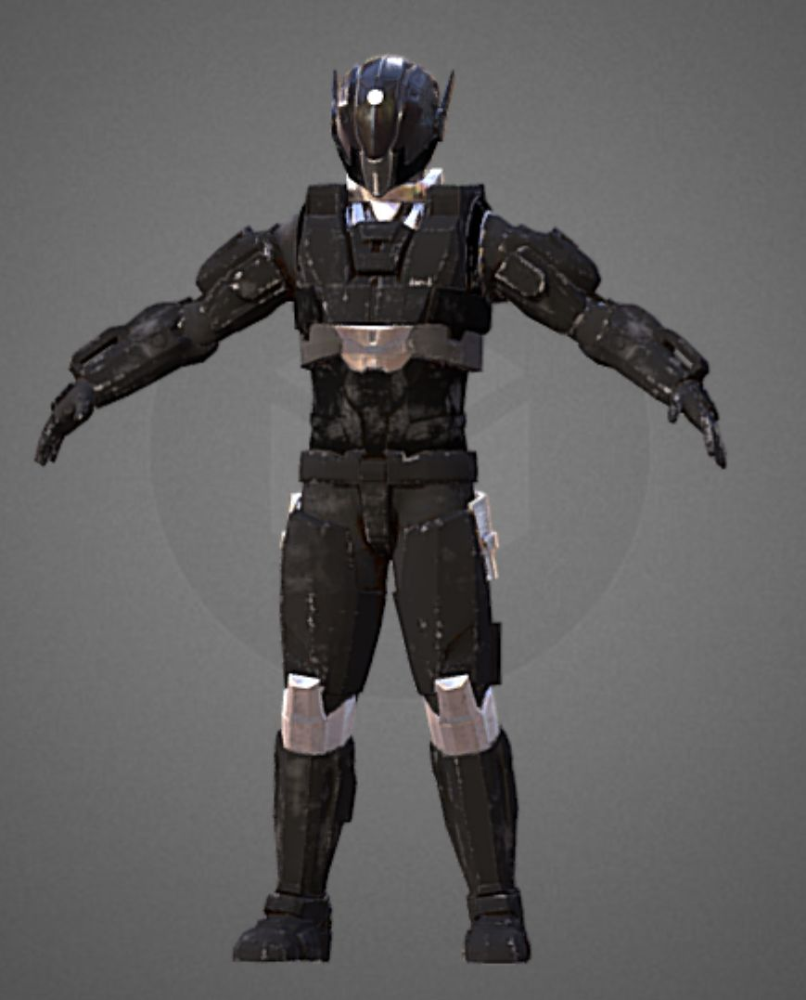

---
## **Gameplay and Mechanics**

### **Gameplay**
The game ends when the player survives 5 minutes. There are many tasks the player needs to achieve during this time:

- Protect the pilot anhttps://hackmd.io/_uploads/B1K1eVvph.jpgd warp drive of the spaceship by guarding the cockpit door and engine
- Fend off enemies swarming the ship using the variety of guns and upgrades provided
- Manage resources such as personal health, ammo, defenses, building materials, and the engine/cockpit door
- Build defenses to slow down and kill enemies
- **Not die**

### **Controls**
The control scheme is shown below.

  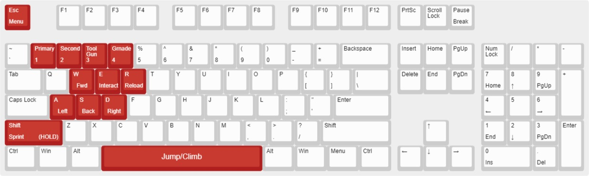

  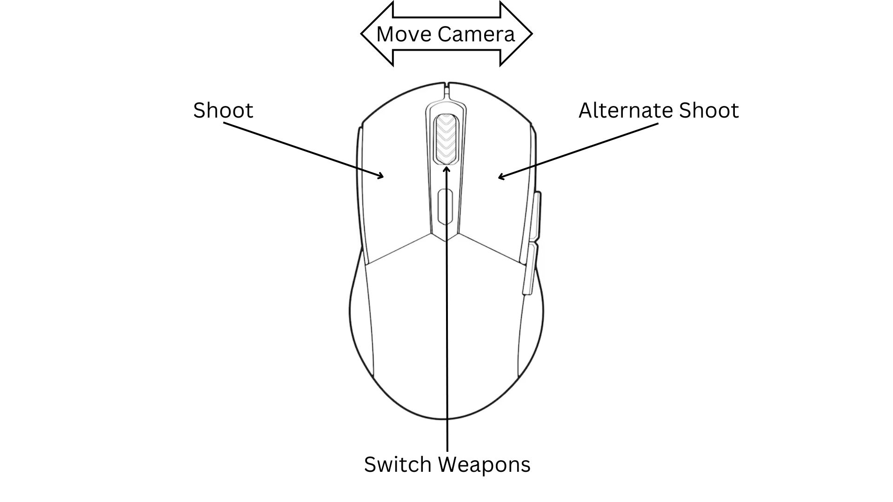

### **Weapons**
The player can choose 1 primary weapon and 1 secondary weapon to use in the game, and a tool used for building. They are detailed below.

#### **Primary weapons:**
There are 5 primary weapons in the game. Each have limited ammo, so it must be rationed accordingly.
| 
 Weapon Model 
 	| 
Name
	| 
 Primary Fire 
	| 
 Alt Fire 
 	| Damage 	| Fire Rate (Shots per second) 	| Clip Size 	| Total Ammo 	| Reload Speed (seconds) 	| 
 Further Details 
 	|
|---	|---	|---	|---	|---	|---	|---	|---	|---	|---	|
| 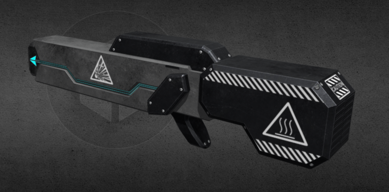  	| The Shotgun 	| Shoots 8 bullets in a cone shape 	| Damaging spikes are shot from the shotgun 	| 15 per bullet 	| 0.8 	| 6 	| 90 	| 1 	| Spikes deal 5 dps, and slow enemies by 25% 	|
|  	| Electric Boogaloo 	| Shoots triple chaining lightning 	|  	| 50 	| 0.5 	| 3 	| 39 	| 3 	| has a 10% chance to stun enemies 	|
|  	| Demo-Man 	| Shoots a grenade that explodes on contact with enemies	|  	| 60 	| 1 	| 8 	| 72 	| 2.5 	| 1m explosion radius 	|
| 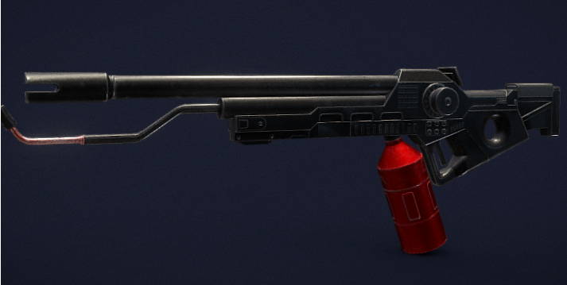 	| GUN451 	| Fires a large flame shell that starts a highly damaging fire 	|  	| 50 	| 1 	| 2 	| 30 	| 0.6 	| Fire does 30dps, and spreads easily 	|
|  	| Moar-Guns 	| Shoulder mounted guns rapidly shoot piercing bullets 	| Fires high explosive rockets 	| 7 	| 10 	| 200 	| 1000 	| 10 	| Lowers move speed by 30% while equipped 	|
#### **Secondary weapons:**
The player can equip 1 secondary weapon along with their primary. These have infinite ammo, but are significantly weaker than the primary guns available. They aim to provide utility alongside the primary weapons, and ensure the player is not left helpless if they run out of primary ammo.
| 
 Weapon Model 
 	| 
Name
	| 
 Primary Fire 
	| Damage 	| Fire Rate (Shots per second) 	| Clip Size 	| Total Ammo 	| Reload Speed (seconds) 	| 
 Further Details 
	|
|---	|---	|---	|---	|---	|---	|---	|---	|---	|
|  	| Gravity Gun 	| Charges and shoots a gravity well that sucks in enemies 	| 15 per second 	| 0.5 	| 2 	| infinite 	| 1 	| Gravity well lasts for 5 seconds with a 5m radius 	|
|  	| Needle gun 	| Burst fires 3 needles that explode into a ball of gas	| 25 per needle 	| 0.8 	| 15 	| infinite 	| 1.5 	| Has 2% lifesteal Gas lasts for 3 seconds with 15dps Gas can explode when ignited 	|
|  	| Hammer 	| Swings the hammer in a wide arc; high knockback 	| 75 	| 1.25 	| N/A 	| N/A 	| N/A 	| Allows for repairing and building while equipped	|
#### **Tool Gun**

The tool gun is equipped in the player's 3rd slot. This consumes goo to:
- Construct and repair defense buildings
        - Buildings are built on a grid, and can be destroyed by enemies.
- Heal damage taken by the ships engine.

Left clicking repairs damage, and right clicking brings up the build menu.
#### **Grenades**
The player can pick up grenades from the grenade station on the ship. There are a large variety of grenades available. Some provide extra damage while others provide utility. To throw a grenade, the default button is the "4" key. 

This model will be used for every grenades, but each will differ in colour and light.

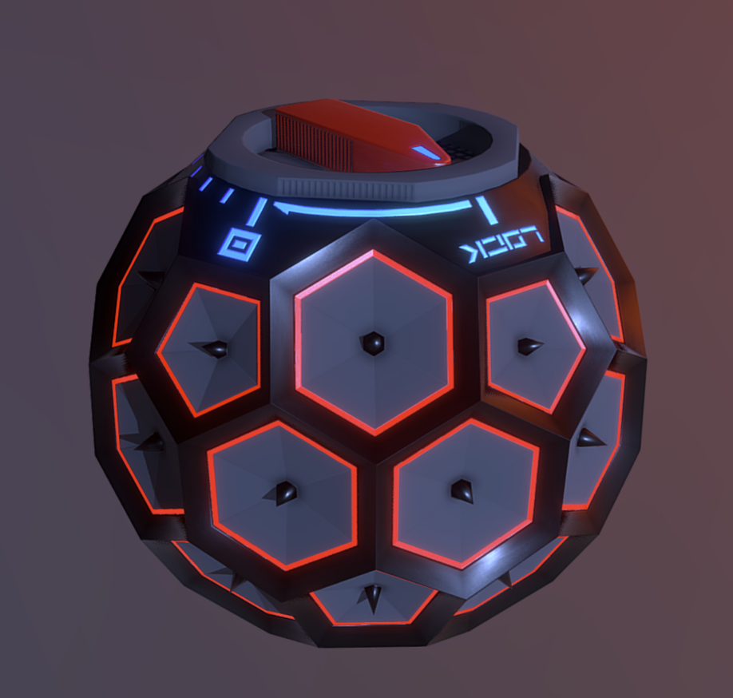

| 
Grenade Name
| 
Throwable
|        
 Description 
|
|-----------------------------|-----------------------------|-------------------------------------------------------------------------------------------------------------------------------------------------------------------------------------------------------------------------------------------------------------------------------------|
| Explosive Grenade             |YES |     Explodes after a short time when thrown   Does moderate damage, with a large explosion area|
|Flame Grenade     |YES|     Explodes on contact and lights enemies and the ground on fire Moderate damage over time |
|Venom Grenade    |YES|Creates a large poison gas area Lingers and does light damage to enemies who pass through Gas can be ignited to explode |
| Stim Shot     |NO|Can be used to heal the player by 40%  Additionally give an overhealth buff of 50% health for 10 seconds  |
| Shield Boost     |NO|Refills the players shields |
| Turret Mini 1000     |YES|After being thrown, activates on contact with the ground Takes 5 seconds to set up, and afterwards shoots nearby enemies for 20 seconds Does not attract enemies due to small size|

---

### **Ship Stations and Buildings**
There are various ship stations around the ship. These can be used by the player to restore resources and provide a tactical advantage against the enemiess. Each ship station's functionality is detailed in [Ship Stations](#Ship-Stations). Some enemies will target the stations, and they cannot be repaired once destroyed. Keeping the stations alive will be important for the players success.

The player can spend goo to build defenses. The placement of these buildings will be an important part of surviving, as it determines how easily the enemies can deal damage. Buildings are detailed further in [Buildings](#Buildings).

### **Player Perspective**
The game is 1st person, so the player perspective is quite simple. The player will see from a camera fixed to the rough position of their head, with rotations controlled by the mouse. The character will not be visible on screen. Importantly, guns will be fired from the head, so if the player can see an enemy, they can shoot the enemy. This simplifies the shooting, and is done in many other games aswell. 

### **Progression**

  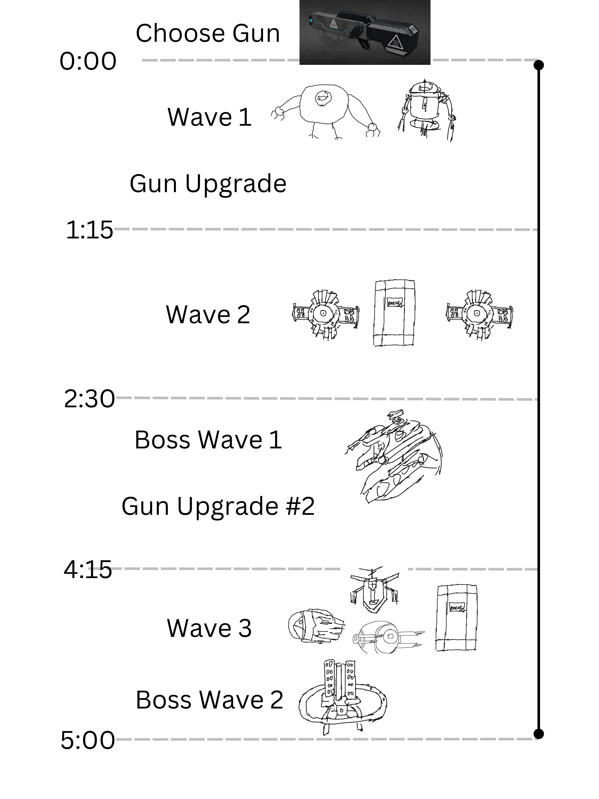

*Player Progression*
Game progression comes from survival. The player chooses a gun at the start of the 5 minute timer. There are two points where the player can choose one of three upgrade options.

*Difficulty*
*Space Nomads* comes with three difficulty levels: Easy, Normal, and Hard. Players can choose a difficulty that fits their desired intensity.

Along with these options, difficulty scales over time. Enemies come in waves, and each succeeding wave is more difficult than the last. Newer waves include more enemies and/or stronger enemies. Additionally, there are Boss Waves where a Boss Enemy accompanies a horde of regular enemies.

Players additionally have to account for resource management. As bullets and buildings are not infinite, so additional efficiency is required to last the whole five minutes.

*Losing*
Losing occurs when the player dies before 5 minutes passes, so the micromanagement of enemies, weapons, and buildings all must be done while avoiding death.

*Scoring*
There are several scores tallied when the player finishes or dies prematurely:
- Damage Taken
- Difficulty Setting
- Objective Damage
- Ship station Damage
- Special Bonuses (No hit, Pacifist, No Primary, Melee Only, etc)

*Space Nomads* is a game that encourages players to try again and aim for more perfect runs. The balance of difficutly and time ensures that the game keeps players engaged while not dragging out the experience too much.

---
## **Levels and World Design**

### Level and Game World
The level encourages players to engage and fight with the enemies. The map is divided into several chambers connected by corridors. Each room is designed for a specific purpose of the game. The Engine is in an adjacent room to the door of the pilot room. Enemies are attacking from the hijacked teleporters located in two different chambers.
    

  

We have created a prototype of this map in Unity to give a better feeling of the ship. Note that this will not be the level for the final game which will be larger and more fleshed out. Playtesting will greatly influence how we design the level. Here is the prototype:

  

The rooms of this map are:
- Supply Room
    A room where the a supply station is located. Ship stations in this room can provide continuous buffs for the player, thus the player needs to prevent enemies from entering this room and destroying the station. A teleport device (light blue) is placed in the middle of the room, which allows the player to teleport to this room from the other friendly teleporter.
- Cockpit door
    One of the primary objectives of the game. The player must keep the HP of the door at a healthy level. If enemies break through the pilot gate (HP drops to 0), the game is over.
- Engine Room
    One of the primary objectives of the game. The player must protect the engine from enemy's attack. Damage taken by the engine can be repaired by using the tool gun. If the engine is destroyed (HP drops to 0), the game is over.
- Enemy Teleporter (red)
         Spawning spot for the enemies. There are multiple entrances for the room so the player needs to always be aware of enemy's attack routes and build defense objects to block enemy waves.
         

  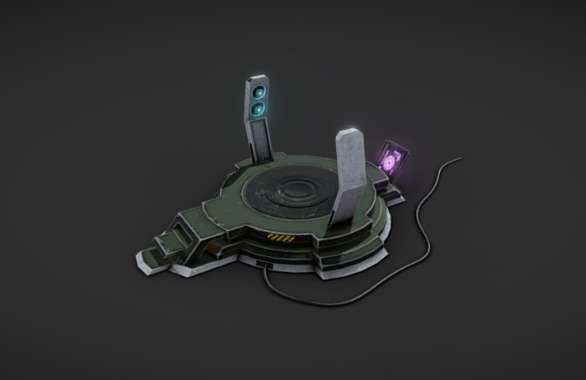

The enemies use these teleporters to enter the spaceship. The marine creatures have used their advanced technology and have been able to successfully hijack the frequency of the teleport channel, allowing them to use some of the ships teleporters, while the player cannot.

There is only 1 level in the game, and we will have a minimap that shows the layout of the map, and which room enemies are in (but not their exact positions.). The minimap will also show the damage that has been done to the various ship stations.

### **Objects**
The main objects in the game include:
- Buildable Defenses
    - The player can build defenses to hopefully slow down the incoming enemies. They are listed below. Each building will have health and can be destroyed by enemies. Some block the enemies path, and some do damage. Buildings cannot be stacked on top of one another and must be built on specific areas on the floor.
- Ship Stations
    - There are various Ship stations around the ship that help the player and can be destroyed by enemies. Some provide resources while others provide help in other ways.
- Goo
    - Enemies sometimes drop goo, which can be picked up by the player and  used for building. Goo can also be acquired through other means, such as from a ship station.
- Grenades
    - Throwable grenades that are explained in more detail in the [Weapons](#Weapons) section.

### **Buildings**
The player can build defences to slow the oncoming enemy onslaught. We have not decided on building models as of yet. The buildable structures available to the player are:
|
 Building Name 
 	| 
 Description 
|
|---	|---	|
Basic Wall| Relatively cheap, medium amount of health Half-size, meaning it can be shot, flown, and climbed over
Tall Wall|More expensive than the basic wall, blocks visibility and flying enemies Slightly more health. 
Strong Wall| Expensive but strong Half size, just like the basic wall
Floor Goo| Medium cost, placed on the floor and slows enemies passing over it Has limited uses, to discourage spam
Beer-Can (Beacon)|Provides a small damage buff to the player when nearby Expensive compared to walls, but well worth it Cannot stack
Electric Gate|Zaps an enemy passing through Does pretty good damage, but takes a while to recharge Low health, and expensive enough to encourage the player to shoot enemies themselves
Gas Spewer|A turret that fires gas Gas does light damage, but is most effective when lit on fire by the player Medium health building, and can shoot over short walls Medium level cost
### **Ship Stations**
The stations in the ship usable by the player are listed below. Once a station is destroyed, it cannot be repaired. There will only be one model used by all of the stations, but each station will have a different colour and texture. If we have time, we will make the stations different models.

  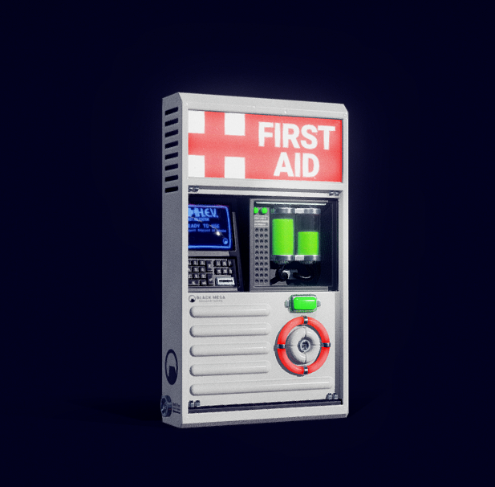

|
 Ship station name 
 	| 
 Description 
|
|---|---|
Health Station|Provides the player with health on interact  Slow recharge, very important for the players sustainability.
Ammo Station| Provides the player with ammo, recharges over time Without this station the player may have to rely on their secondary gun, which may cause issues
Goo Station|Gathers goo from the surrounding atmosphere, and on interaction gives the goo to the player, which can be used for repairing and building Aids the player greatly, beefing up their defenses
Grenade station| Provides the player with grenades on a set interval Dispensed grenades are random
Door station| Allows the player to select 2 doors to close on the spaceship Lets player direct enemies towards their defenses and take more control over the environment If destroyed, the doors re-open Not available in prototype
Teleporter| Allows the player to teleport to a different part of the ship  May not be implemented in the prototype as it will be more usefull for a larger map  Can be destroyed but have very high health 
Enemy teleporter| Hijacked by the enemies  Used to teleport onto the ship Cannot be destroyed by the player, and is red instead of blue

### **Physics**
- Basic flying physics will be the in game, so we can see other ships fly around us. These will not end up actually being physics, and moreso just floating spaceships.
- Physics will be used for any projectiles, and there will be standard gravity.
- Unity's collision engine will do the bulk of the collisions work, we don't have anything too complicated going on. Carefully choosing collider layers will be necessary to make sure certain things run smoothly, for example we don't want the gun to collide with the player, otherwise it would look strange.

---
## **Art and Audio**
### **Art Style**
*Overall aesthetic*
The scenere for the game will be set on a futuristic spaceship. The overall art style of the game will be a combination of cyberpunk, sci-fi, and heavy industry imagery.

  

*Colour*
The colour will be dominated by neon hues such as blue, purple and pink which will be shown via the lights we place in the spaceship. For other structures like walls and the ground, the colouring will be metallic black and gray.
    

  

    
*Shapes*
The shapes in the game will be angular and sharp, to give a futuristic feeling. Enemies may be rounder or more organic, as they are fish.

*Textures*
The textures used for the ship will be cold and metalic.

  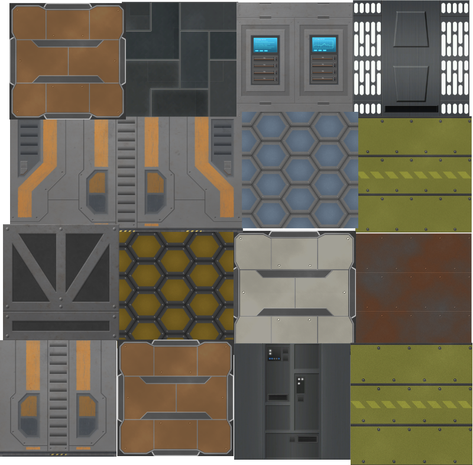

### **Sound Design**

Sounds will be used in the game to emphasize certain themes. In the game there is a large focus on combat and the enemy. Many of the sounds will be related to weapons being shot, the sounds enemies make passively, and different sounds when attacking. 
There will be voice acting for dialogue spoken by the pilot. This will not be available in the prototype, as it will take significant effort to do well. There will also be some voice lines for the player that are not story related. For other sounds, we plan to either source sounds online, or try our hands at making them ourselves through whatever means necessary. 

Below is a list of sounds we think are important to focus on in the game. We may add more sounds. 
- Footsteps for all entities, player included.
- Sounds for enemies based on what type, so the player can tell what enemies are nearby by audio alone.
- Pilot dialogue. Whoever on the team is the best at voice acting will be the pilot.
- Player voice lines. We may include voice lines for the player. We mostly want these to make the character you are playing feel more detached, as they are the bad guy.
- Gun noises, shooting, reloading etc.
- Building noises. If a building is not static, then it should make a sound when it moves.
- Ship station noises. Maybe just a low hum or some kind of noise when used. Teleporters will have a sound associated with them.
- Ambient ship noise, such as a engine noise. This is to break up the silence in the game if the player turns music off.
- Door noises.
### **Music**
The music in the game will aim to be upbeat and very present to increase the feeling of intensity while playing. To fit with the theme, we plan to use music that feels electronicy/futuristic. This will fit with the pace of the game. For example, as bosses arrive or the game comes to an end, the music may increase in intensity to reflect this.

An example of the type of music we plan to use is below. We are interested in using songs from Spotify, as this is not a commercial product, and that is quite a unique possibility.
[Potential music playlist](https://www.youtube.com/playlist?list=PL3sBcPyc4pQGzAOxg4Dw_rGWnrozIhz8v)

We aim to avoid using the exact same music style as the popular video game DOOM, which uses a very heavy metal soundtrack. We plan to use more electronic music.
### **Assets**

| Asset                         | Type    | URL                                                                                                 |
| ----------------------------- | ------- | --------------------------------------------------------------------------------------------------- |
| Shotgun                       | Model   | https://sketchfab.com/3d-models/sci-fi-gun-b-a944a5131d464764bffaf37b8b2f3fd0                       |
| Electric Boogaloo             | Model   | https://sketchfab.com/3d-models/wip-amprex-remodel-2a0dcc4b98a34440b4ce00060162ceb4                 |
| Gun451                        | Model   | https://sketchfab.com/3d-models/flame-thrower-78ee33188c7040808d142725f05bb738                      |
| Teleporter                    | Model   | https://sketchfab.com/3d-models/sci-fi-mobile-teleporter-818f2e70362041cb8fee9f68a97b45fe           |
| Ship Station                  | Model   | https://sketchfab.com/3d-models/half-life-first-aid-station-remake-9045cec377e44a209c3ea73740274050 |
| Regular Enemy                 | Model   | https://sketchfab.com/3d-models/robot-2020-c0dadae4d1884bf48615f1ee301fe7e6                         |
| Medic Enemy                   | Model   | https://sketchfab.com/3d-models/m3dic-2d22cf3acac24deb9e3887db4d3d95cd                              |
| Regular Smarter Enemy         | Model   | https://sketchfab.com/3d-models/mech-drone-8d06874aac5246c59edb4adbe3606e0e                         |
| Camera Robot Enemy            | Model   | https://sketchfab.com/3d-models/industrial-theme-robot-56c7aa071a72437e9e4401718131e2b6             |
| Shield Enemy                  | Model   | https://sketchfab.com/3d-models/industrial-theme-robot-56c7aa071a72437e9e4401718131e2b6             |
| Gravity Gun                   | Model   | https://sketchfab.com/3d-models/workshop-laser-pistol-97ed2fadb0ec4885b575a9eb77c544e4              |
| Ranged Enemy                  | Model   | https://sketchfab.com/3d-models/scifi-drone-11-dd21953e81a24bd385d16eaf0c6a8ae7                     |
| Pilot                         | Model   | https://sketchfab.com/3d-models/scifi-robot-eb2daac32d6840cdb854e2c7ad141763                        |
| Grenade                       | Model   | https://sketchfab.com/3d-models/cyber-frag-grenade-5d38fc47b9e24a4f8084d7995dfceeea                 |
| Exploding Enemy               | Model   | https://sketchfab.com/3d-models/sci-fi-toad-a4beb5c0c4b548108b28ef4a891ccec7                        |
| Spaceship Environment Texture | Texture | https://assetstore.unity.com/packages/3d/environments/sci-fi/sci-fi-construction-kit-modular-159280 |
| Sci-fi Gun Shot               | Audio   | https://freesound.org/people/humanoide9000/sounds/330293/                                           |
| Background Music              | Audio   | https://www.youtube.com/playlist?list=PL3sBcPyc4pQGzAOxg4Dw_rGWnrozIhz8v                            |

---
## **User Interface (UI)**
 
### **UI Layout**
A material count display will be essential information for the player. Ammo count, health, menu, and loadout will also be included. There will be a UI element used for when the pilot speaks for the player to read. An objective and timer will also be shown. The rough layout is shown below.

  

### **UI Theme**
This UI will be futuristic. It will look similar to the moodboard below, but a little bit simpler with less clutter. 

  

### **Menu Screen**

The menu screen will be a general game menu which offers three buttons that allow the user to start the game, view a tutorial screen, and quit the game. There is also a setting icon at the corner. This allow users to adjust voice volume, resolution, and controls. The background will show the spaceship is ready to invade the earth.

  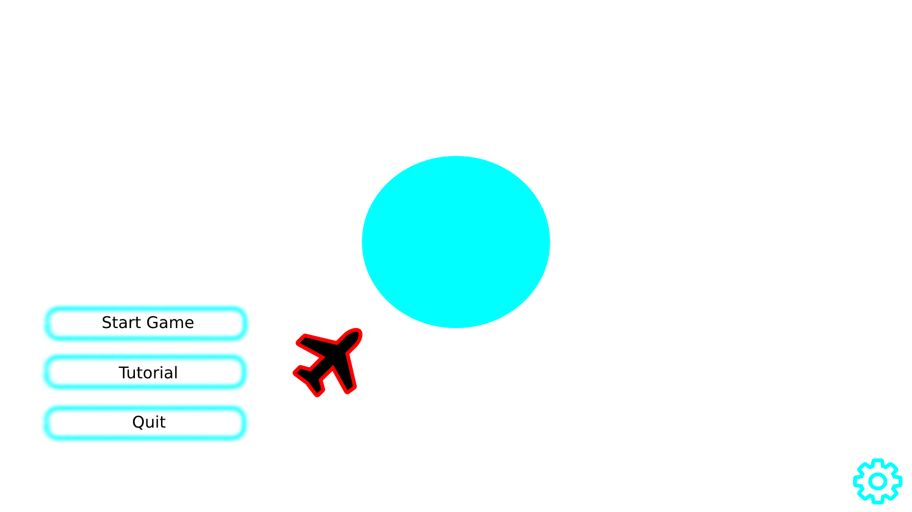

---
## **Technology and Tools**
- Github and Unity.
- Ryder editor and Visual Studio.
- Maya
- MudBox
- Substance Painter
- Audacity audio editor
- Jdownloader2 (for audio ripping from youtube)
## **Team Communication, Timelines and Task Assignment**
Our team consists of 2 undergraduate computer science students (Jack/Raja), and 2 masters IT students (Billy/Brysen). We have allocated roles based on if someone especially wanted to do that roll, which aligns with our strengths quite well. The basic outline is as follows:

- Programming: Jack and Raja
- Modeling/animating: Billy/Brysen
- Texturing: Billy/Brysen
- Level design: Billy/Brysen
- audio design and creation: Everyone
- Trailer video: Whoever is free
- Sprite editor/image editor: Raja and Brysen
- Scene organiser: Jack and others

For organisation and more specific task allocation, will will use generally Trello, with some minor programming organisation done through TODO's in the code itself. Jack will organise the code, and other stuff will be organised by a group.

The group will meet up 1-3 times a week, either in person or online. This has been working well so far. General text discussion is held on discord.

## **Possible Challenges**
- Animating certain weapons may prove difficult, And if we can't find a way to animate these then we may have to find shortcuts.
- Fitting a building placement mesh over our created level model will be a challenge. The current solution is to line them up carefully, or alternatively snap buildings together not on a mesh. These solutions are not perfect, but we will have to use them if we cannot solve the issue. This will be tested in the prototype.
- The difficulty of the game, and especially difficulty over time, will be hard to balance. If the game is too easy, it won't be very fun, but if its too hard, it won't be playable. This will require testing, and carefull game design to make these bounds as loose as possible.
