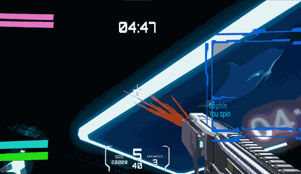

# Project 2 Report

## Table of Contents

* [Evaluation Plan](#evaluation-plan)
* [Evaluation Report](#evaluation-report)
* [Shaders and Special Effects](#shaders-and-special-effects)
* [Summary of Contributions](#summary-of-contributions)
* [References and External Resources](#references-and-external-resources)

## Evaluation Plan

### **Evaluation Techniques**

#### Observational Techniques

The *Think Aloud* technique was used to allow us to understand the real user's thoughts and
feelings as well as identify any usability issues or confusing areas about the
game in real-time. Furthermore, this technique can also ensure
engagement during the game playing. We can obtain insights into their
decision-making process and observe any challenges they face.

Players who participate in the test were asked to play the game and
try to verbalize their thoughts and feelings. These also included
any thoughts about the decisions when they progress and navigate the
game. There was no help and instructions provided during these sessions unless
players faced some unconquerable difficulties. The whole testing process
took about 30 minutes.

#### Querying Techniques

The querying techniques used were Questionnaires and Post-Game interviews.

The questionnaires came in a the form of a [Google form](https://forms.gle/rSmRXC1o9qBCDQbm7). This was sent alongside the game to as many people we knew who would be interested in the game. Participants were asked to play the game for at least 10 minutes and then fill out the form when they were done. Some participants also had informal feedback if they were not keen on filling out the lengthy form.  This querying technique was used because it was cost-efficient, and was able to collect lots of data, which complements our other methods well.

Interviews were also conducted after *Think Aloud* sessions. These used the questions from the questionnaire but additionally allowed for follow-up questions with the interviewees for possible clarifications or additional information about any input towards the game. The technique is effective as a check. The open-ended nature of interviews allows us to possibly uncover points of interest not addressed in any of our other query methods.

### **Participants**

Participants in the evaluation were recruited from previously formed contacts, ranging from friends, family, roommates, classmates, and anyone who was interested in playing the game. This ensured that the participants in the *Think Aloud* and interview evaluation methods fit the target audience. To do this, participants had to have some first person video game experience and be within the target age demographic (15-30 years old). For the questionnaire, all participants were accepted. As the questionnaire contained questions on the participants' age/previous gaming experience, results could be filtered later.

### **Data Collection**

**Think Aloud:** 

For this technique, the majority of data will be collected via note-taking and observation of player behaviour. *Think Aloud* sessions were audio recorded, which were able to be rewatched at a later time.

**Google Form:**

The questions used were based on concerns we had about certain aspects of the game, such as:
- Game Difficulty/Balance
- Game Optimisation
- Gunplay and Movement
- Map Design
- UI Design
- Communication of Story to the Player
- Game Bugs

Other questions were also included to collect data on the demographics on the players. We did this so that we could selectively prioritise some respondents over others based on membership within target demographic. Depsite this, the game and form were sent to as many people as possible. This was done because it is logistically cheap. More data is also not an issue as we can choose to focus on our target demographic after collecting data. 

After responses were recorded, the feedback was read and useful ones were selected and implemented to improve the game.

### **Timeline**

We gave ourselves one week to gather responses and interviews, after which we would analyse the responses collected. The form and game was sent out to non-interview participants on day one, and the interviews were carried out when possible. The timeline actually ended up being much shorter than anticipated. Responses to the Google form came in very quickly, and about 5 interviews were carried out in one day. A little bit more time was still given, so that as many responses as possible could be gathered. To process the responses, a meeting was held where notes on responses were gathered to be used to improve the game. These notes are discussed in [Evaluation Report](#evaluation-report). This meeting was quite short, about 90 minutes.

### **Responsibilities**

The responsibilities were divided as follows:

Questionnaire creation/distribution: Jack.

Interviews/Observational Evaluation: Raja, Brysen, Billy.

This division was primarily determined by Jack's inability to easily conduct interviews in person, so he decided to handle the online forms instead. Processing of results was done as a group.

## Evaluation Report

### **Methodology**
We used two methods for evaluation. The first was a structured questionnaire to collect quantitative data on respondents' impressions, enjoyment level, and difficulty of the game, as well as their opinions on in-game balance, maps and art. The second was a *Think Aloud* approach to gain qualitative insights into the players' experience of the game. Observations and real-time communication were used to gain a deeper understanding of their interactions and challenges.

### **Participants' Age Group and Gaming Experience**
Our participants were mainly within the age group of 15-24 years old, and the majority of them reported abundant experience in gaming with an average score of 8-9 out of 10.

### **Game Evaluation**

**First Impressions**

Players' first impressions of the game showed a variety of responses. Some appreciated the creative design and challenging gameplay, while others said the weapon selection screen was confusing and the objective of the game was unclear.

**Enjoyment Level**

The majority of players were satisfied with the overall experience of the game; however, some of the game's mechanics were not as user-friendly or optimised as they could have been. For example, the reload time for weapons was too long. There were also some issues with the balance of weapons, particularly the hammer being overpowered.

**Game Art Style and Map Design**

Players are generally satisfied with the game's art, however, in some scenes it was too dark or the colours of the enemies overlapped too much. This made it impossible to tell where the enemies were. Regarding the map design, since the objective of the game is to focus on two rooms, players were not fully motivated to explore other rooms. They thought the design itself was good, but they seldom explored during the game.

**User Interface and Navigation**

Players were generally satisfied with the interface, but their main comments centred on the navigation. There was very little navigation information in the game resulting in a lack of knowledge of where to go when they first started playing. They hoped that the quests and objectives in the game would be clear enough.

**Sound and Music**

Most players felt that the soundtrack was appropriate for the background and gameplay. Players, however, felt that the lack of certain in-game sound effects such as the sound effects of the gun's bullet changes resulted in a lack of realism in the bullet changes. Players also made some suggestions, such as providing different soundtracks for different game scenarios.

### **Improvements Based on Feedback**

**Map Optimisation**

First of all, we optimised the map slightly. We changed the position of the engine to allow the player to explore more of the map. Additionally, we added some markers to point to specific areas or locations, such as the Pilot Door and the Engine Room. We fixed some of the non-collision-volume locations that were causing the player to fall out of the map. We also added collision volumes to locations where they did not exist which caused players to fall out of the map.

**UI Enhancements**

Based on feedback, we added a more comprehensive resource consumption screen with grenade counts, goo counts, and a blood bar for each enemy. We also gave in-game resource dispensers more UI tooltips, such as cooldown indicators and resource gain amounts. We also removed the UI for Hammers and Tool Hands and added some UI text on how to use the current weapon or tool.

**Weapon Balancing**

We rebalanced the damage, change time, and change method of weapons so that they now change automatically with an animation for each weapon that needs to be changed.

**Audio Enhancements**

We added background music and voiceovers to the opening screen to increase immersion and allow players to better understand the game's backstory. We also added more impact and bullet change sounds for each weapon.

**Enemy Enhancement**

We introduced two enemies that specifically target the player. One is a self-destructing enemy and the other is a melee enemy that only targets the player. The main purpose of adding these two enemies is to make the gameplay more versatile and diverse.

**Tutorial Guide Added**

In addition to the two map guides, we also added an introduction guide to the opening scene to help players better understand the game's resources, objectives, enemies, and available props.

## Shaders and Special Effects

### Dissolve Shader
**Shader Link**: [Disolve.shader](https://github.com/COMP30019/project-2-synergy/blob/b471778edd2d88bfdd95a7d0e26a464e071cc1f1/Assets/Custom%20Shaders/Disolve.shader)

**Shader Control Script Link**: [disolvecontrol](https://github.com/COMP30019/project-2-synergy/blob/b471778edd2d88bfdd95a7d0e26a464e071cc1f1/Assets/Scripts/disolveControl.cs)

**Shader1 Demonstration**

**Structure of This Shader**
#### Properties
`_MainTex`: Main texture that allows objects can have the base color.
`_TextureForDisolve`: Controls how it will looks when dissolved
`_DisolveY`: Represents a y-coordinate value, which the parts of the object below this y-coordinate will gradually transition from being invisible to visible based on the dissolve texture.
`_DisolveSize`: Controls the size of the dissolve effect
`_Starting`: Where to start to dissolve.

#### SubShader Define
Tags is Opaque means it will not be transparent. `LOD 100` means the level of detail will be defult

#### `Pass`
This shows that this shader will use `vert` and `frag` to perform this effect.

#### `vert`
This part of code shows three steps:
1: Convert vertex positions in object space to positions in clipping space.
2: Convert texture coordinates.
3: Calculate the position of a vertex in world space.

#### `frag`
This part of code also shows three steps to make the dissolve effect functional:
1: Calculate the transition as the difference between `_DisolveY` and the fragment's Y coordinate in world space.
2: Use the clip function and dissolve texture to decide whether the current fragment should be rendered. If the argument to the clip function is less than 0, the clip will be discarded and will not be rendered.
3: Samples a color from the main texture and returns it.

#### Short Summary
This shader uses parts of the vertex and fragment shaders, mainly to achieve an inverse dissolve effect. The main inputs are `_MainTex`, `_TextureForDisolve`, `_DisolveY`, the control of the size `_DisolveSize` and the starting point `_Starting`. The main output is the rendered colour. In conjunction with the `disolveControl` C# script, a new material instance is created for each object and the `_DisolveY` parameter is incremented to achieve the reverse dissolve effect. This effect is mainly used in the in-game build function to allow a smooth emergence of newly built objects. Since an object may be built repeatedly, it is necessary to create a new material instance for each object. This shader is now applying on `buildableWall` and `buildabletallWall` materials.

### Outline/Texture Shader.
**Shader Link**: [FresnelTest.shader](https://github.com/COMP30019/project-2-synergy/blob/b471778edd2d88bfdd95a7d0e26a464e071cc1f1/Assets/Custom%20Shaders/FresnelTest.shader)

This shader was created as a response to players not being able to distinguish enemies from the surroundings. The shader uses a reflection based-technique to put a coloured outline around objects it is applied to. The shader also displays textures.

##### Demonstration of Shader:

 

#### Shader Details:

The shader has 2 parts. The first part is the fresnel effect. This is based on the principles of how the shallower the angle between you and the surface of an object, the brighter reflections will become. The second part is a texture map, which was added as some of the enemies this shader applies to come with textures, which are important to incorporate into their appearance.

##### Fresnel Effect:

The fresnel effect is borrowed from the effect that light has on objects that are at a shallow angle to the eye. To experience this effect, look at a tabletop that is at a distance from you or place your eye at tablelevel. The surface will appear shinier than usual. In this application, instead of making shallower angle's reflect light more, we replace the reflection with a chosen colour, which is brighter at shallower angles.

The method for producing the fresnel effect is straightforward. It can be made into a vector or fragment shader. For the sake of generality, consider only a "point" in 3d space, instead of a vertex, or pixel.
The parameters for this step are:
- `Color`: The color which the fresnel effect uses, for us we used red
- `Scaling`: How strong the effect is
- `Power`: How sharply the effect responds to shallow edges; a higher power will restrict the effect to edges more aggressively

The method to produce the effect is as follows:
- Calculate world position of target point and the world normal at that point
- Calculate the difference vector between the camera position and target position
- Perform a dot product on the difference vector and the world normal. At shallower angles, the dot product will be closer to 0. Store this dot product in a variable called `fresnelRate`.
- Given a colour at the given point $C$, and the  produce the output colour $O$ via the following formula

$$ O = C + \text{Scaling } * (1 + \text{fresnelRate})^\text{Power} $$

- The output colour is provided to the next step for mixture with the texture. The incoming vertex position was not changed in this step.

##### Texture Mapping:

After creating the above effect, we realised that this shader would not be applicable to all of the enemy models we were using. Some enemies had textures that we did not wish to ovverride. It thus became necessary to incorporate texture rendering into the shader. This step is very simple and uses the same method taught in workshops. 

This step only applies to the fragment shader stage, and it is necessary to pass a UV texture coordinate from the mesh this shader is applied to. The required parameters for this effect are:
- `useTexture`: Float that is set to 1 if we intend a texture to be used, and 0 otherwise
- `Texture`: 2D texture that we wish to apply to our object

The method is very simple. Given a colour provided by the fresnel step, we simply add this colour to the texture colour and get our result. If the input colour is $C$, and our texture function is $f$, with a UV coordinate at this point given by $UV$, calculate the output colour $O$ with: 

$$ O = 
\begin{cases}
C,  & \text{useTexture } = 0 \\
C + f(UV), & \text{otherwise}
\end{cases}$$

By texture function, I mean a function that maps a UV coordinate to a colour based on the provided texture in Texture.

This part of the shader can be seen in the 2nd picture above, with the robot that is highlighted red, but still textured.

#### Implementation in Unity:

The shader is implemented in unity via Materials, which are stored in the assets folder, each material stores paramaters for a particular shader application, and can be applied directly to enemies. An example of a material used is:

In this application, the parameters are configured to give a sharp outline with a texture being provided as well. This material was then applied to the desired enemy.

#### Issues and Limitations:

This shader has a couple of issues. The first is that the outline effect does not look appealing on very flat parts of enemies at is appears more like a light reflecting. On round enemies, it works very well. 

Another limitation is that some of our models used multiple complicated texture maps, such as Emission or other textures. These layers can be properly rendered with Unity's built in shaders, but ours does not. This means that the shader still could not be applied to all enemies as some would look visually unappealing when applied. This would have been fixed if we could have found a way to apply multiple shaders.

### Black Hole Particle Effect.
**Particle Effect Link**: [BlackHole.prefab](https://github.com/COMP30019/project-2-synergy/blob/b471778edd2d88bfdd95a7d0e26a464e071cc1f1/Assets/Prefabs/gun/Projectiles/BlackHole.prefab)

**Particle Effect Demonstration**:

This particle effect was used with the Black Hole Gun, and the projectile it was attached to would suck enemies in. The idea behind the effect is to create a kind of spherical black/white mass that appears to rotate and pull particles inwards. To create the effect, particles are spawned at the centre, pushed outwards, and then pulled inwards, all while rotating around the centre of the blackhole. The colour changes over time, making the centre of the blackhole appear a bit whiter than the edges. To complete the effect, trails are connected between particles to give the blocky effect that gives the blackhole density, while not increasing complexity and remaining efficient for rendering purposes.

### Shotgun Bullet Effect

**Particle Effect Link**: [https://github.com/COMP30019/project-2-synergy/blob/8d5aaafb6abe2280777476e0194edbc7681d5a56/Assets/Particle/ShotgunBulletEffect.prefab]

**Particle Effect Demonstration**:

This is a cone shape particle effect which only plays once when triggered by adjusting the speed of each particle and adding a tail for each of them.

## Summary of Contributions

#### Raja:
- Coded most of the areas that Jack did not touch. Wrote all of the code for the [UI](https://github.com/COMP30019/project-2-synergy/tree/main/Assets/Scripts/UIScripts), although Jack edits some of this code later on, and the `InGameVolumeManager` of the [Management](https://github.com/COMP30019/project-2-synergy/tree/main/Assets/Scripts/ManagementScripts) folder
- Edited [Player, Gun](https://github.com/COMP30019/project-2-synergy/tree/main/Assets/Scripts/Player%20and%20Gun%20scripts) and [Enemy](https://github.com/COMP30019/project-2-synergy/tree/main/Assets/Scripts/EnemyScripts) scripts for any UI functionality such as healthbars and end game scores
- Results panels indicating damage dealt per gun and enemies killed
- Minor bug fixes in areas such as the Gun Upgrades and Ship Stations
- Scene Transitions between Intro, Main Menu, Gun
Selection, Gun Upgrade, Game, Pause, Death, and Victory game states
- Settings configuration to account for desired healing rates, audio, and mouse sensitivity
- Outsourced needed materials for HUD and UI elements
- Created a [helmet visor](https://github.com/COMP30019/project-2-synergy/tree/main/Assets/HelmetModels/Models/curved_ui_less_2) for the HUD display in Blender
- Conducted *Think Aloud* sessions and interviews afterwards with 5 participants, each took roughly an hour
- Writing about *Think Aloud* sessions and interviews
- Proofreading and edting the report

#### Zhuoran (Brysen):
* Majority of all modelling, texturing, prefabs in the game
* Majority of all outsoured models such as guns and enemies
* Wrote the whole evaluation plan in this report
* Do the game map design and map modelling using ProBuilder
* Made all animations in the game
* Made shotgun bullets' particle effect and outscoured majority of particle effects
* Wrote dialogue box script, line update script for medic drone and colorswitch script for a specific room
* Made storytelling and recorded all voice for in game dialogue
* Made storytelling, image sourcing, voice recordings, and timeline in start scene
* Made disolve shader and its controller script
* Conducted two *Think Aloud* sessions with 2 participants to gather qualitative data
* Reduced assets folder under 250MB by compressing every texture, model, and audio

#### Wenhao (Billy):
- Audio editing and mixing for gun reloading and some in-game SFX
- Particles effects creation and texture for exlposion and on-hit effect
- Responsible for the trailer video editing and audio mixing
- Created textures and shader for the portal
- Textures, model fetching, and first version of map design with ProBuilder
- Graphic design for gameplay guide menu

#### Jack:
- Majority of the backend gameplay code; created most of the scripts in the [Enemy](https://github.com/COMP30019/project-2-synergy/tree/main/Assets/Scripts/EnemyScripts), [Player](https://github.com/COMP30019/project-2-synergy/tree/main/Assets/Scripts/Player%20and%20Gun%20scripts) and 50% of the scripts in [Management](https://github.com/COMP30019/project-2-synergy/tree/main/Assets/Scripts/ManagementScripts) folders.
- 100% of the music, and approximately 50% of the sounds present in the game. Audio editing/fixing up for all sounds
- Some particle effects, namely the black hole, and editing other various particle effects
- Google form for game evaluation
- Fresnel shader and its implementation
- Organising meetings, mostly just picking a time
- Designing guns and some enemies
- Writing about shaders, and the evaluation plan section

## References and External Resources

### Sounds/Music
#### Music:
| Name | Artist |
| --- | ----------- |
| Code | Comet is coming |
| Journey through the Astroid belt | Comet is coming|
| Main menu music, Vol.1 | STAHL|
| E.M.P.eror | Smash Stereo|
#### Sounds:
| Name | Link |
| --- | ----------- |
| DrillAttack.mp4 | https://www.youtube.com/watch?v=C0_M9rcWmY4 |
| GrenadeLauncher2.wav | https://www.youtube.com/watch?v=4Pp2IdOfois |
|LaserGunSound.mp4|https://pixabay.com/sound-effects/search/laser/|
|LightningStrike.mp4|https://freesound.org/people/alexdarek/sounds/583742/ |
|shotgun-firing-4-6746.mp3|https://www.youtube.com/watch?v=pTIJfrTxFbw|
|HealingSound.mp4|https://freesound.org/people/jtn191/sounds/514272/|
|FlyingRobot.mp4|https://freesound.org/people/Globofonia/sounds/553728/|
|Walking fast.mp3 and Walking Slow.mp3|https://www.youtube.com/watch?v=DJcc4F65RBo&t=5s|
|sci-fi cannon.mp3|https://freesound.org/people/humanoide9000/sounds/422440/|

### Code references
Some youtube videos were usefull in understanding unity, especially pathfinding. To clarify, no code was taken directly from the videos, but certain algorithms were mimicked or adapted to suite our project.
- Destructible objects by AI by LlamAcadamy: https://www.youtube.com/watch?v=fBu4_psgTXs&ab_channel=LlamAcademy
- Understanding the fresnel effect: https://www.dorian-iten.com/fresnel/
- Fresnel Outline Shader for Picking up Items: https://www.gamedev.net/blogs/entry/2264941-fresnel-outline-shader-for-picking-up-items/
- Helmet HUD: https://www.youtube.com/watch?v=0V4o_bDm_II

### Models:

| Name            | Link                                                                                                |
| --------------- | --------------------------------------------------------------------------------------------------- |
| Silly robot     | https://sketchfab.com/3d-models/robot-2020-c0dadae4d1884bf48615f1ee301fe7e6                         |
| Smart Enemy     | https://sketchfab.com/3d-models/mech-drone-8d06874aac5246c59edb4adbe3606e0e                         |
| Explosive enemy | https://sketchfab.com/3d-models/sci-fi-toad-a4beb5c0c4b548108b28ef4a891ccec7                        |
| Grenade         | https://sketchfab.com/3d-models/cyber-frag-grenade-5d38fc47b9e24a4f8084d7995dfceeea                 |
| Pilot           | https://sketchfab.com/3d-models/scifi-robot-eb2daac32d6840cdb854e2c7ad141763                        |
| Fish            | https://sketchfab.com/3d-models/animated-low-poly-fish-64adc2e5a4be471e8279532b9610c878             |
|Medic Drone      | https://sketchfab.com/3d-models/m3dic-2d22cf3acac24deb9e3887db4d3d95cd |
| Fly Drone       | https://sketchfab.com/3d-models/scifi-drone-11-dd21953e81a24bd385d16eaf0c6a8ae7                     |
| Station         | https://sketchfab.com/3d-models/half-life-first-aid-station-remake-9045cec377e44a209c3ea73740274050 |
| BlackHoleGun    | https://sketchfab.com/3d-models/gravity-gun-low-poly-67e21e0c431c427bbcdac5c3149fbb35 |
| GrenadeGun      | https://sketchfab.com/3d-models/doom-grenade-launcher-068c409d910547819cd154682ba5992b |
| GrenadeGun      | https://sketchfab.com/3d-models/doom-grenade-launcher-068c409d910547819cd154682ba5992b |
| Hand            | https://sketchfab.com/3d-models/robotic-hand-0a18fb697d1c4f9d9f743cede8593f1f |

### Texture ###
* ultimate texture pack: https://assetstore.unity.com/packages/2d/textures-materials/ultimate-sci-fi-panel-materials-128234

### UI ###
* Used to create icons out of all our 3D models: https://github.com/AndreaDev3D/ThumbCreator
* Used the different images, meshes, and materials to create the helmet HUD: https://github.com/mixandjam/MetroidPrime-Hud
